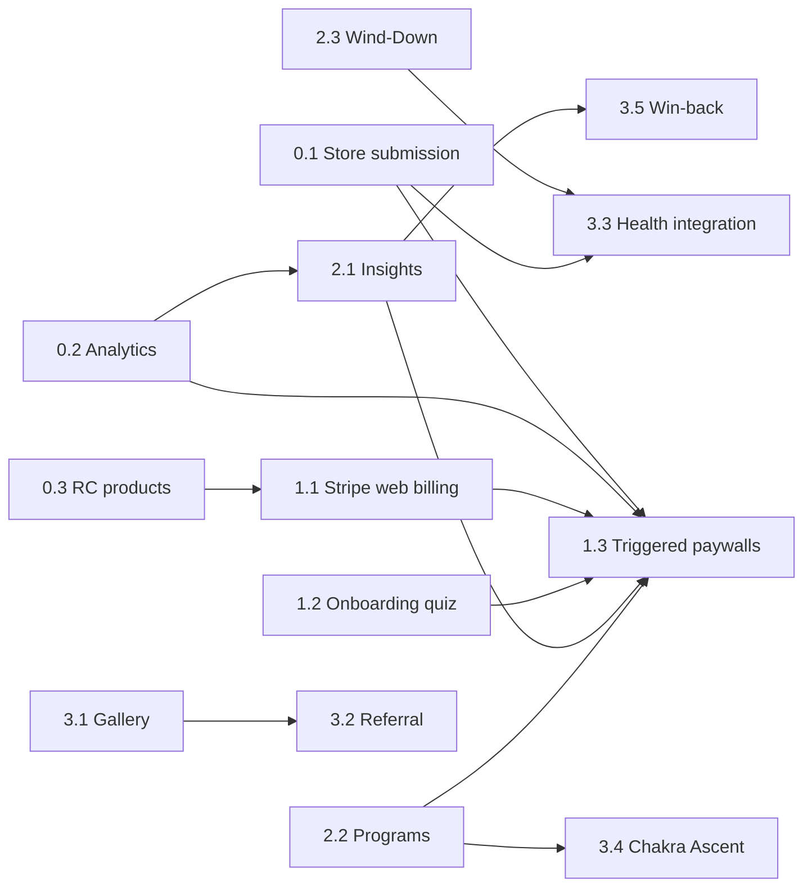

# Rise In Harmony — Development Plan

**Created:** July 8, 2026
**Implements:** RISEINHARMONY_STRATEGIC_PLAN.md (strategic enhancement plan)
**Grounded against:** the actual codebase as of commit `0dc8529`

This plan translates the strategic recommendations into concrete engineering work,
sequenced by dependency and (impact ÷ effort). Estimates are focused dev-days for
one engineer working with an AI agent.

---

## Codebase reality check (what already exists)

The strategic plan assumes more greenfield than is true. Current assets:

| Strategic need | Already in codebase |
|---|---|
| Pricing tiers UI | `PremiumPaywall.tsx` already renders Monthly $7.99 / Annual $49.99 / Lifetime $149.99 — matches recommended structure exactly. Web CTA is a "Coming soon" toast; **no web billing backend** |
| Mobile billing | RevenueCat fully wired (`usePurchases.ts`, `server/revenuecat.ts` incl. `grantPromotionalEntitlement` — usable for referrals/win-backs) |
| Onboarding intake | `users.onboardingGoal` + `onboardingCompleted` columns; web `OnboardingModal`; mobile `onboarding.tsx` with goal→frequency recommendation |
| Insights data | `sessions` table logs frequencyHz, durationSeconds, moodRating, journalNote, startedAt — everything insight cards need |
| Streaks/stats | `getUserStats` computes streak, minutes, top frequencies, mood average |
| Retention surface | Dashboard with streak calendar, chakra map, weekly goals |
| Native app | v1.0.1 built on EAS (iOS + Android), **not yet submitted to stores** |
| Analytics | PostHog wired on web + mobile (`useAnalytics`) — needs event coverage for funnel metrics |
| Sounds/mixes | `user_sounds` + `studio_presets` tables — foundation for the community gallery |

**Consistency fixes (strategic P0 item 3.0) are already shipped** (commit `0dc8529`, live in production).

---

## Phase 0 — Foundation (week 1) · ~3 dev-days

Goal: app in stores, funnel instrumented. Everything later depends on this.

### 0.1 Store submission (0.5 d + review wait)
- `eas submit -p ios --latest` and `-p android --latest` (profiles already configured)
- App Store Connect / Play Console metadata, screenshots (Precision Player FFT is the money shot per audit)
- On approval: flip `IOS_APP_LIVE = true` in `client/src/pages/Alarm.tsx`; add store badges to homepage hero + footer
- **Guardrail:** verify alarm reliability on a physical device with silent mode + Focus enabled before marketing any reliability claim

### 0.2 Funnel instrumentation (1.5 d)
Add PostHog events (both platforms, shared naming):
- `onboarding_started/completed` (with goal), `first_alarm_set` (activation metric)
- `paywall_viewed` (with trigger source), `trial_started`, `subscription_purchased` (tier)
- `session_completed` (frequency, duration, mode), `mood_logged`
- `program_enrolled/day_completed` (forward-compat for Phase 2)
- Dashboards for: D1/D7/D30 retention, alarm-set rate, trial→paid, annual share, mood-log completion rate

### 0.3 RevenueCat product setup (1 d, mostly console work)
- Create `rih_premium_annual` ($49.99, 7-day trial) and `rih_founder_lifetime` ($149.99) in App Store Connect + Play Console + RevenueCat offerings
- `server/routers/subscription.ts` webhook already maps `rc_promo_premium_lifetime` etc. — extend product-ID mapping for the new SKUs
- Mobile paywall (`app/paywall.tsx`): render offerings dynamically (it already lists packages) — verify annual + lifetime render with trial copy

---

## Phase 1 — Convert (weeks 2–5) · ~13 dev-days

Goal: monetization works on both platforms; new users get a guided first path.
Success gate (from strategy): trial→paid ≥ 30%, annual ≥ 60% of new subs.

### 1.1 Web billing via Stripe (5 d) — the biggest gap
Web has zero payment capability today.
- Stripe products mirroring the RC SKUs; Checkout Session flow (monthly/annual with 7-day trial, lifetime one-time)
- New `server/routers/billing.ts`: `createCheckoutSession`, `createPortalSession`; Express webhook `/api/stripe/webhook` (raw-body, like `soundsUpload.ts`) → updates `users.subscriptionTier/subscriptionExpiresAt`
- Schema: add `stripeCustomerId` to users; log events into existing `subscription_events`
- Cross-platform entitlement rule: `subscriptionTier` is the single source of truth; Stripe and RevenueCat both write it (server already reads it everywhere)
- Replace paywall "Coming soon" toast with Checkout redirect; add "Manage subscription" (portal) to Dashboard
- Tests: webhook tier-mapping unit tests mirroring existing `revenuecatWebhook` tests

### 1.2 Goal-based onboarding quiz (3 d)
Upgrade both onboarding surfaces from single-question to the 60-second plan-builder:
- 4 questions: primary goal (sleep/focus/calm/spiritual) → wake time → experience level → headphones availability
- Output = "frequency profile": recommended tone, suggested first alarm (pre-filled, one tap to confirm), filtered library view, recommended first meditation
- Persist to `users.onboardingGoal` (exists) + new `onboardingProfile` JSON column
- Headphone answer drives binaural vs isochronic defaults (audit issue #9 solved as a side effect)
- Reuse mobile’s existing goal→frequency mapping; port to web `OnboardingModal`

### 1.3 Moment-triggered paywalls (2 d)
Trigger `PremiumPaywall` / mobile paywall at proof moments (each fires once, tracked in localStorage/user row):
- Streak reaches 7 → "protect your streak" framing
- First positive insight card viewed (Phase 2 hook, wire the trigger now)
- Second alarm creation attempt (free tier: 1 alarm)
- Program day 8 (Phase 2 hook)
- Each passes `trigger` to `paywall_viewed` for per-trigger conversion measurement

### 1.4 Free-tier boundary enforcement (2 d)
Strategy defines Free = 7 frequencies, 7 meditations, **1 alarm**, studio presets, dashboard basics:
- Alarm limit: server-side check in `alarms.create` + UI upsell state
- Audit current gating for drift (e.g. recorded sessions premium flags) and align with the published tier table

### 1.5 Founder Lifetime cap (1 d)
- `founder_count` check on purchase server-side; "X of 500 remaining" on paywalls; founder badge on Dashboard

---

## Phase 2 — Retain (weeks 5–10) · ~14 dev-days

Goal: the day-3-to-day-30 arc. Success gate: D30 retention +25% vs Phase 0 baseline.

### 2.1 Personal Resonance Insights (4 d)
The evidence engine over existing `sessions` data:
- `server/routers/insights.ts`: `weeklyInsights` query computing —
  top mood-lifting frequency (avg mood by frequencyHz, min 3 sessions), best time-of-day (mood by startedAt bucket), streak-vs-mood correlation (mood on streak days vs off), minutes trend WoW
- Dashboard "Your Resonance" card section (replaces the static "Avg Mood: 0" dead-end)
- Empty states that *coach* toward data ("Log 3 moods to unlock your first insight")
- Weekly insight email via existing Resend integration (respect existing dedup-timestamp pattern)
- **Guardrail:** copy is descriptive only ("your logged mood after 528 Hz averaged 4.2") — never therapeutic claims. Add a copy-review checklist item to the PR template.

### 2.2 Structured Programs (6 d)
- Content model in `packages/shared-utils/src/programs.ts` (static catalog, same pattern as `meditations.ts`): day number → activity ref (tone/meditation/studio preset) + duration + affirmation copy
- Launch programs: **21 Days of Resonance** (morning arc), **7 Nights of Deep Sleep** — days 1–7 free, 8+ premium
- Schema: `user_programs` (userId, programId, startedAt, currentDay, completedAt) + `program_day_completions`
- tRPC `programs` router: enroll / today / completeDay / abandon
- Web: Programs section (Library or nav) with day cards, progress ring, completion badges. Mobile: mirror screen
- Day-8 paywall trigger wires into 1.3

### 2.3 Evening Wind-Down (3 d)
Mirror of the alarm for bedtime, closing the daily loop:
- Schema: reuse `alarms` table with a `kind: "wake" | "wind_down"` column (avoids a parallel table)
- At scheduled hour: notification → opens Studio with a chosen preset + sleep timer pre-armed
- Web: browser notification path (same infra as alarms); Mobile: expo-notifications schedule
- Onboarding quiz (1.2) gets a fifth optional question: "bedtime reminder?"

### 2.4 Streak freeze (1 d)
- `users.streakFreezesRemaining` (1/month for premium, cron-replenished via existing scheduled-task pattern)
- Streak computation in `getUserStats` consumes a freeze on a 1-day gap; Dashboard shows freeze state

---

## Phase 3 — Deepen (months 3–5) · ~15 dev-days

Success gate: organic (referral + gallery) ≥ 15% of new installs.

### 3.1 Community Mix Gallery (6 d)
- Extend `user_sounds` + `studio_presets`: `isPublic`, `publicName`, `tags`, `cloneCount`, `reportCount`
- tRPC `gallery` router: publish/unpublish, browse (recent/popular/by-tag), clone-to-my-sounds, report
- Moderation: name-only text risk → profanity filter + report threshold auto-hide + admin page list (extend existing `Admin.tsx`)
- Web gallery page + "Publish" action in Precision Player/Studio save flows; mobile read-only browse first
- Each public mix page is shareable (organic acquisition surface)

### 3.2 Referral loop (3 d)
- "Gift 7 days of Premium": referral codes table; redemption grants promo entitlement via existing `grantPromotionalEntitlement` (RC) / Stripe coupon (web); both parties get a streak freeze
- Share sheet on mobile, copy-link on web; `referral_redeemed` analytics

### 3.3 Health integration — mobile (5 d)
- `expo-health-connect` (Android) + HealthKit via `expo-apple-health`-class module (iOS); **requires a new EAS build**
- Read sleep duration → Dashboard insight: "sleep on alarm-streak days vs off days"; write mindfulness minutes on session complete
- Permission-first UX; feature-flagged so it can ship dark
- **Note:** verify current Expo SDK 54-compatible health module before committing; scope may shift ±2 d

### 3.4 Chakra Ascent program (1 d)
- 7-week program (one chakra/week) on the 2.2 system — pure content, extends the existing chakra map loop

### 3.5 Win-back offer (1 d)
- Lapsed-trialist email (existing re-engagement email infra) with personal stats + one-time $39.99 annual (Stripe coupon / RC offer)

---

## Phase 4 — Expand (months 5–12) · evaluate, don't pre-build

Only after Phases 1–2 gates are met with real numbers:

- **Adaptive recommendations** (~5 d when greenlit): rules-based "tonight we suggest Theta + Rain" from mood/sleep/time data. Explicitly *not* a chat companion (cost, safety review burden, off-brand)
- **Smart-speaker pilot:** Alexa skill spike (1–2 d) — evaluate after native-app traction data
- **B2B pilot:** team seats + anonymous aggregate streak dashboard — decide with real retention data
- **Android parity check:** confirm feature flags/UX parity before Play marketing push

---

## Sequencing & dependencies

Total estimated effort: **~45 focused dev-days** across 4 phases. Phases 0–2
(the strategy's "achievable in one to two quarters" core) are ~30 dev-days.

## Standing guardrails (every phase)

1. **No therapeutic claims** — insights/programs copy stays descriptive of the user's own logged data; keep all existing disclaimers
2. **Web-alarm honesty** — keep expectation-setting copy until native app adoption is high
3. **No catalog-size chasing** — new content only inside program structures
4. **Migration discipline** — every schema change goes through `drizzle` migration + Manus `db:push` (learned: local env has no `DATABASE_URL`)
5. **Deploy discipline** — web ships via Manus pull+deploy; mobile native-module changes require EAS build (OTA otherwise); large binaries never in the static deploy path (serve from Manus storage)
